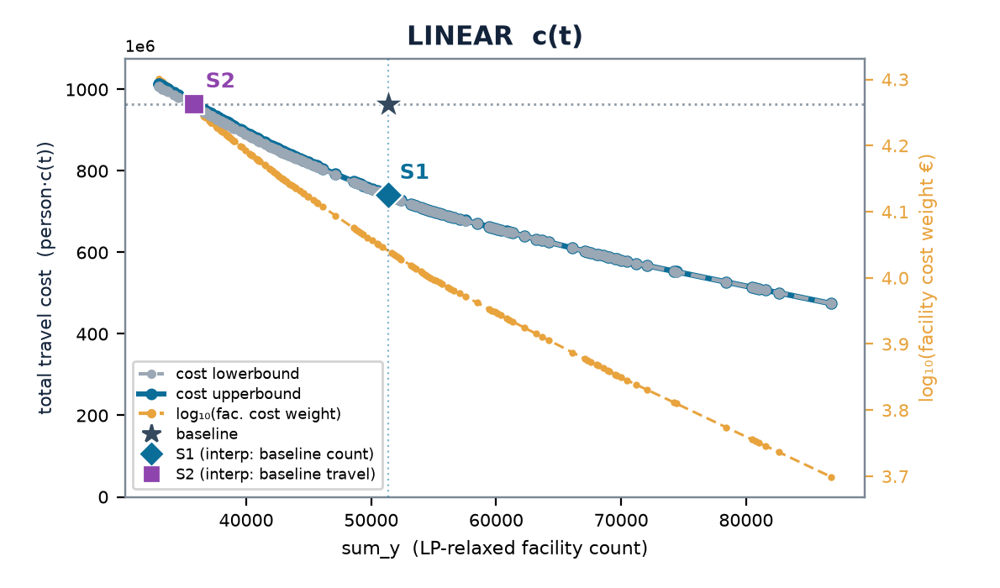
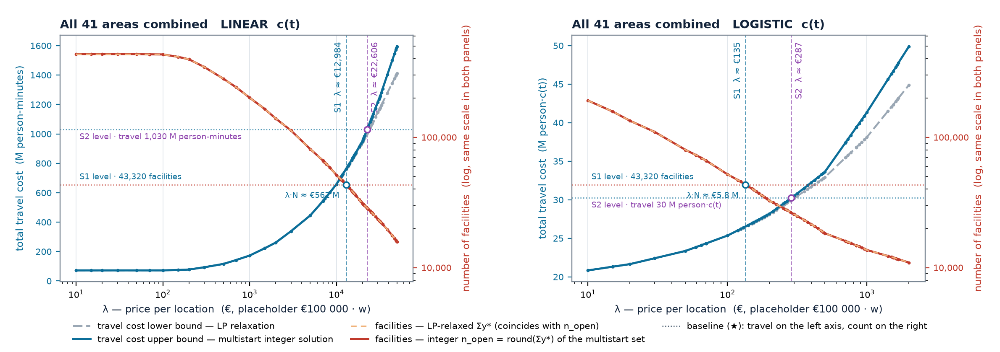
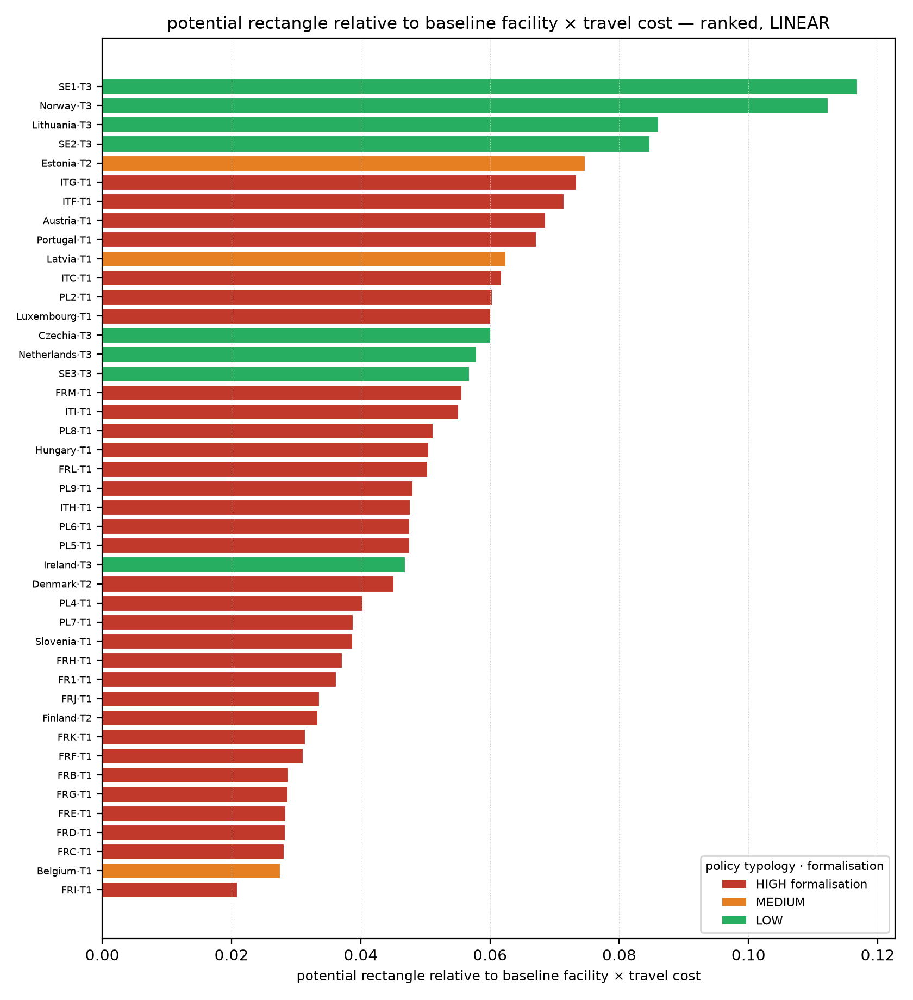
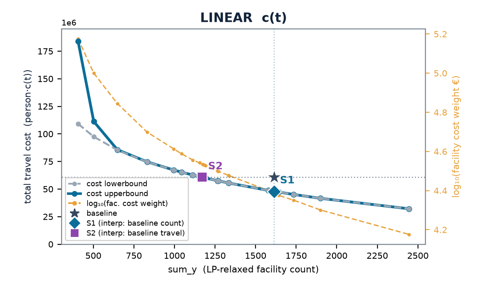

# NetworkModel_EU — `ServiceAccess` branch

Where should a service network's facilities be, and how far is today's network from that?
This branch answers it for **pharmacies** across 42 European study areas: a road-network
origin–destination matrix from GeoDMS, a facility-location LP in Julia swept over the price
of a location, and a Pareto frontier of *number of locations* against *population travel
cost* — with today's network placed on it.

Developed by [Object Vision b.v.](https://www.objectvision.nl) for the JRC (CRISP-EU).
Companion documents: the results deck [`doc/lambda_sweep5.pptx`](doc/lambda_sweep5.pptx)
(September 2026) and the [project wiki](https://github.com/ObjectVision/NetworkModel_EU/wiki).

- [What the pipeline does](#what-the-pipeline-does)
- [Components](#components)
- [Algorithms](#algorithms)
- [Results (September 2026)](#results-september-2026)
- [Running it](#running-it)
- [Status and roadmap](#status-and-roadmap)

---

## What the pipeline does

```
 GeoDMS  (cfg/main.dms, STUDY_AREA=<area>)                       per study area
 ├─ NetworkSetup       TomTom road network → cleaned, per-landbody connected network
 ├─ Analyses/…/Allocation  impedance_matrix_od64: every populated 1 km² cell to every
 │                      candidate cell within its choice set  → <area>_od.arrow
 │                                                              <area>_i.arrow  (clients)
 │                                                              <area>_j.arrow  (candidates)
 └─ Analyses/Pharmacies/Descriptives   catchment statistics of today's pharmacies
                          │
                          ▼
 Julia  (lambda_sweep_simplex.jl → lp_run.jl → settings.jl)
 ├─ baseline            every client → nearest existing pharmacy by road
 ├─ λ-sweep             one LP per λ on the same model, warm-started dual simplex (HiGHS)
 ├─ rounding            LP fractions → a real set of p pharmacies (multistart + swaps)
 └─ S1 / S2 / S3        equal count · equal travel · the whole frontier
                          │  logs/sweep_<area>_<FUNC>.log
                          │  <area>/lambda_sweep/<FUNC>/<w=…|S1|S2>/{assignment,traveltime}.arrow
                          ▼
 doc/  (Python + Node)   parse logs → charts → per-region slides → deck  ·  frontier metrics
 GeoDMS                  reads the S1/S2 open sets back (SweepResults) for mapping
```

Two travel-cost functions are swept in parallel: **LINEAR** `c(t) = t` (minutes) and an
adapted-logit **LOGISTIC** `c(t) = 1 / (1 + e^{−(t−25)/10})`. Every figure in the deck exists
for both.

---

## Components

### GeoDMS (`cfg/`)

| Item | Role |
|---|---|
| `cfg/main.dms`, `ModelParameters.dms` | Study area from `STUDY_AREA` (env, via `Expand`), grid size, client definition (`Client := 'population'`), choice-set knobs. |
| `NetworkSetup.dms`, `Templates.dms` | Builds the working road network from the TomTom extract (`CreateInitialWorkingNetwork` → `CreateMoreEfficientNetwork`). Keeps the largest strongly-connected component **per landbody**, not one per study area, so islands and their ferry links survive. |
| `Analyses.dms` → `Allocate_T` | The OD matrix: `impedance_matrix_od64('bidirectional(link_flag);startPoint;endPoint;cut(OrgZone_max_imp);limit(OrgZone_max_mass,DstZone_mass);alternative(link_imp):alt_imp;od:…')`. `cut` = 120 min; `limit` = 5 with mass 1 only on existing-pharmacy cells, so a client's choice set is *every candidate within the road time to its 5th-nearest existing pharmacy*. Exports `DistanceTableExport`, `ClientExport`, `FacilityExport`. |
| `Analyses/AllocateClientsToExistingPharmacies` / `…ToNewPharmacies` | The two sides: the observed network (baseline) and the candidate set (cells with ≥ 50 residents ∪ existing-pharmacy cells). |
| `Analyses/Pharmacies/Descriptives` | Today's network by road catchment: residents per pharmacy and per 1 km² location, empty/shadowed pharmacies, catchment percentiles. One Arrow row per area. |
| `Analyses/…/SweepResults` (`ReadSweepResults_T`) | Reads `baseline`, `S1`, `S2` open sets per travel function back into GeoDMS. |
| `SourceData/Locations.dms` `services_allocated` | Reads the exported `<area>_<s1|s2>_<linear|logistic>_open.arrow` location files. |

### Julia (repository root)

| File | Role |
|---|---|
| `settings.jl` | Paths, `COUNTRIES`, the travel-cost functions `c(t)`, `big_cost()`, facility-cost placeholders (`FACILITY_MIN_COSTS = 100 000`), Arrow loaders, subsampling knob, and the **region-exclusion rule** (issue #49). Everything is env-overridable. |
| `lp_run.jl` | The engine. `build_lp_warmstart` / `solve_at_w!` (the soft-coverage LP, solved along the λ-grid from the previous basis); `greedy_round`, `multistart_round`, `swap_round!`, `travel_of`, `assign_nearest` (rounding and scoring); `run_scenario` (the older hard-coverage LP with a minimum-catchment penalty, used by `lp.jl` / `greedy.jl`). |
| `lambda_sweep_simplex.jl` | **The sweep driver used for all results.** Baseline metrics, common w-grid, per-w LP → rounding → log line, S1/S2 bracketing, and the per-point Arrow outputs. |
| `lambda_sweep.jl` | Earlier parallel variant (one fresh LP per w, `MAX_PARALLEL` threads). Superseded by the warm-start driver; kept for reference. |
| `lp.jl`, `greedy.jl`, `greedy-merge.jl` | The school-era scenario runners: hard coverage, `min_clients` deficit penalty, IPM; grid searches over `min_clients` and `w`. Not used for the pharmacy results. |
| `cap_scenario.jl`, `s1_cap.jl`, `s2_cap.jl` | The catchment-cap ladder (S1-A/B/C, S2-A/B) *without* a cost function: fixed count under a max-catchment cap, or minimum count under min+max caps. Explored on the Netherlands; **not pursued** (see roadmap). |
| `export_s1s2_locations.jl` | Joins each area's `S1`/`S2` `assignment.arrow` to `<area>_j.arrow` and writes the open locations in the name `Locations.dms` reads. |
| `collect_descriptives.jl` | Gathers the per-area descriptive Arrow rows into `doc/pharmacy_descriptives.csv` (+ `_nuts1.csv`). |

### Orchestration

| Script | Role |
|---|---|
| `run_pharmacy_pipeline.bat <area…>` | GeoDMS, existing side: `network1 network2 alloc` steps. |
| `run_new_pharmacy_pipeline.bat <area…>` | GeoDMS, candidate side: same three steps on the candidate cells. |
| `run_new_country_sweeps.ps1` | Orchestrator for a new area: both pipelines, then the LINEAR and LOGISTIC sweeps; resumable, progress to `logs/orchestrator_progress.log`. |
| `run_rebuild_all.ps1`, `run_realloc_all.ps1` | Rebuild networks + ODs on both sides (after the landbody fix) / re-export only the client and facility tables (they carry the NUTS column the exclusion rule reads). |
| `run_recalc_batch.ps1`, `run_resweep_batch.ps1` | Per-area workers: rebuild + re-sweep, or sweep only. Several run side by side in visible consoles. |
| `run_cap_scenarios.bat`, `make_descriptive_table.bat` | The cap-ladder runs; the descriptive table over all areas. |
| `parse_compare.py` | Quick comparison of the sweep logs. |

### Deck and metrics (`doc/`)

`build_deck_data.py` (logs → `deck_data.json`) → `build_charts.py` (per-region charts) →
`build_deck.mjs` (region + summary slides, pptxgenjs) → `merge_deck.ps1` (concept slides +
generated slides → `lambda_sweep5.pptx`, PowerPoint COM). `frontier_metrics.py` computes the
improvement rectangle, the diagonal crossing and λ at the crossing per area;
`frontier_charts.py` draws the ranked lists and the point cloud; `lambda_axis_chart.py` draws
the sweep along λ (bounds on travel and the facility count per λ); `rebuild_analysis_slides.ps1`
appends those charts as the deck's analysis section; `policy_typology.py` / `region_typology.jl`
attach the regulation typology and DEGURBA class used to colour the ranked lists.
`doc/README_deck.md` has the run order.

---

## Algorithms

### The model — uncapacitated facility location with soft coverage

For clients *i* (populated 1 km² cells, weight `pop_i` = residents) and candidate cells *j*,
over the OD pairs the road network delivers (`t_ij ≤ 120` min, within the choice set):

```
min   Σ_i pop_i · [ Σ_j c(t_ij)·x_ij  +  BIG·(1 − Σ_j x_ij) ]   +   λ · Σ_j y_j
s.t.  Σ_j x_ij ≤ 1            a client may be left unserved
      x_ij ≤ y_j              only to open facilities
      0 ≤ y_j ≤ 1,  x_ij ≥ 0  (LP relaxation of y_j ∈ {0,1})
```

- *x* is assignment, *y* is facility openness — the p-median convention (ReVelle & Swain 1970).
- **Soft coverage**: a client the model cannot or will not route is priced at `BIG` — 120 min
  under LINEAR, 1.0 (saturation) under LOGISTIC — and at the *same* price in the baseline, so
  the star and the frontier are directly comparable. This lets the frontier extend below the
  full-coverage floor and makes every area bracket S1 and S2.
- λ = `w · €100 000` is the price of a location. The €100 000 is a **placeholder**: the
  frontier, the scenario deltas and the ranking of areas do not depend on it, only the € labels.
- The strong disaggregated formulation (one `x_ij ≤ y_j` per OD pair) has an LP relaxation
  that is nearly integral in practice; the sweeps confirm it (`frac_y` stays small).

### The λ-sweep — one LP per λ, warm-started

`build_lp_warmstart` builds the model once; `solve_at_w!` only rewrites the *y* objective
coefficients and re-solves with HiGHS dual simplex from the previous optimal basis. The
grid is 1-2-5 per decade, `w ∈ [1e-4, 5]`, common to every area, extended upward until S1
brackets. `LP_TIME_LIMIT` turns a pathological point into a skipped point. Each λ is a slope:
the optimum is where a line of that slope last touches the feasible set, and the lower-left
envelope of all tangencies is the Pareto frontier. Points in a concave dent of the frontier
are unreachable by any λ — those need a fixed-count solve (roadmap).

### From fractions to pharmacies — the multistart rounding

An LP-guided matheuristic, seconds per point (the LP dominates):

1. **Fix the count** `p = round(Σ_j y*_j)`, so the rounded point stays on the relaxation's axis.
2. **Seed 10 sets**: top-*p* by *y**; the lazy-greedy set (CELF — marginal travel gains are
   submodular); 8 *y**-weighted random draws (Efraimidis–Spirakis A-Res). Must-open
   facilities (*y** ≈ 1) always stay.
3. **Polish by swaps**: best-improving open↔closed swaps over the fractional pool — the
   p-median vertex-substitution search in its fast-interchange form (Resende & Werneck 2007);
   ≤ 12 rounds per seed, each accepted only on an exact travel improvement.
4. **Score coverage-honestly, keep the best** (`travel_of`): every client at its nearest open
   facility, a stranded client at `BIG`.

Because the result is a feasible point of the same problem, `LP relaxation ≤ integer optimum
≤ multistart` — a certified gap on *total* cost, reported next to every figure.

### Scenarios

| | Definition | How it is read |
|---|---|---|
| **Baseline ★** | Today's pharmacies; each client to its nearest by road time; unreachable clients at `BIG`. | `baseline_metrics` |
| **S1** — same count, less travel | Travel minimised at today's number of locations. | Interpolated on the multistart frontier at the baseline count. |
| **S2** — same travel, fewer locations | Count minimised at today's travel cost. | Interpolated where the frontier crosses the baseline travel level. |
| **S3** — the whole frontier | Every tangency; fewer facilities *and* less travel in between. | The sweep itself. |

Gains are stated in **native units first** — locations and person-minutes (or logistic
cost with the mean minutes beside it) — and only then priced by the λ at which the sweep
reaches each point.

### Scope rules — what the model deliberately excludes

1. **Network per landbody.** The largest strongly-connected road network is kept for every
   separate landbody. Before, one component survived per study area, which pruned island
   networks and the ferry links inside them (ITG: mean travel 22.3 → 4.9 min; unreachable
   residents 983 169 → 591). No source data changed.
2. **Region exclusion** (issue #49). If more than 50 % of a NUTS region's inhabitant
   locations are absent from the OD matrix, the whole region — population *and* candidates —
   is dropped, judged on the existing network so baseline and sweep agree. Level NUTS3 where
   populated, else NUTS2, else NUTS1. Today that excludes the Azores and Madeira: population
   but no pharmacy anywhere in the source data (Portugal baseline travel −62 %). A data gap
   must not rank as policy headroom.

After both rules, residents still unreachable within 120 min are 0.012 % of the total; 34 of
41 areas have none.

### The choice set, and where it binds

Each client's OD row holds every candidate out to the road time of its 5th-nearest
*existing* pharmacy — ~70–90 candidates on average, a radius fixed by today's five. When the
optimiser removes facilities the radius does not grow, so at S2-level counts it can bind:
SE2 at S2 has 10.2 % of residents with exactly one open facility left in their radius; ITF a
third of the population one closure from stranding. The frontier is under-estimated wherever
the radius rather than the geography decides who can be served. Widening the candidate radius
is the first remaining item on the roadmap.

### Aggregation and metrics

- **Aggregated frontier** over the 41 disjoint areas (13 countries + FR/IT/SE/PL NUTS-1;
  country-level Poland dropped in favour of its 7 NUTS-1): at a common λ the sum of the
  regional optima *is* the combined optimum (separability), summed at the union of swept
  w-values inside the range every area covers, log-interpolated where an area lacks the exact λ.
- **Improvement rectangle** per area: baseline ↔ S1 (vertical) ↔ S2 (horizontal); its area,
  raw and relative to baseline `count × travel`; the frontier crossing of the baseline→corner
  diagonal; and **λ at that crossing** — the price per location at which the balanced
  improvement is the optimum. Areas are ranked on these and coloured by pharmacy-regulation
  typology (`doc/policy_typology.csv`).

### Not pursued — the catchment-cap ladder

`cap_scenario.jl` implements the cost-function-free rungs (S1: fixed count under a max
catchment cap, multiple or one per cell, urban held fixed; S2: minimum count under min + max
caps). It was run on the Netherlands and dropped on 4 September 2026: observed catchments vary
so widely (residents per location p10 4 394 … max 34 905 in NL alone) that realistic min/max
bounds cannot be set. The λ-sweep is the general method.

---

## Results (September 2026)

From `doc/lambda_sweep5.pptx`; every number below has a LOGISTIC twin in the deck.
Two method changes since the previous deck — landbody-complete networks and region
exclusion — make these figures **not comparable with earlier ones**.

### Today's network

Residents per pharmacy range from ~2 200 (Lithuania) to ~10 700 (Denmark); per 1 km² location
from ~3 800 (Latvia) to ~12 300 (Denmark). Within-country spread is wide everywhere (NL:
p10 4 394, median 10 167, max 34 905 residents per location). France has 660 "empty"
pharmacies — never the road-nearest for any populated cell. Full tables: deck p3–6,
`doc/pharmacy_descriptives*.csv`.

### The aggregated frontier — 41 areas, 43 320 pharmacy cells today



| | point | w | locations | Δ locations | Δ travel |
|---|---|---|---|---|---|
| LINEAR | **S1** same count | 0.130 | 43 357 | +0 % | **−26 %** |
| | **S2** same travel | 0.227 | 28 609 | **−34 %** | +0 % |
| | fewest swept | 0.5 | 15 808 | −64 % | +55 % |
| LOGISTIC | **S1** same count | 0.00130 | 44 416 | +3 % | **−13 %** |
| | **S2** same travel | 0.00282 | 26 673 | **−38 %** | −0 % |

Read: relocating today's pharmacies without adding any would cut population travel by about a
quarter (linear); holding travel where it is, about a third of the locations are surplus.

### The same sweep read along λ



The frontier hides λ. Read along it instead — λ on a log axis, the two travel-cost bounds on the
left (LP relaxation below, multistart integer solution above) and the facility count on the right —
and the sweep's dynamics show: the count collapses over two decades of λ (LINEAR: from ~433 000
below €100 per location to ~43 000 at S1) while the travel bounds stay on top of each other, and
they separate only near S2. The dotted lines are the baseline, so S2 is where travel crosses its
baseline and S1 where the count crosses its; the guides are the interpolated crossings (the same
rule as the S1/S2 tables), each labelled with the quantity that defines it — S1 with its facility
count, today's 43 320, and the facility cost λ·N at that λ; S2 with its travel cost, today's — and
the count axis is logarithmic and shared by the two panels, so S1 sits at the same height under
both cost functions. The two count curves coincide by construction —
`n_open = round(Σy*)` — the certified bound is on *total* cost, not on the count; the informative
gap is the one on the left axis. Under LOGISTIC the whole picture is compressed into λ ∈ [€10, €2 000],
the degeneracy noted on deck p64. Per area: `doc/lambda_axis_chart.py <REGION>`; the Netherlands
version is in the deck (p66).

### Per country — S1 and S2 (LINEAR; LOGISTIC in the deck)

| country | today | S1 · Δ travel | S2 · Δ locations | λ S1 | λ S2 |
|---|---|---|---|---|---|
| Netherlands | 1 615 | −12.1 M min · −19.9 % | −443 · −27.4 % | 24 532 | 34 329 |
| Belgium | 2 958 | −3.2 M min · −14.9 % | −520 · −17.6 % | 5 666 | 7 340 |
| Denmark | 466 | −5.5 M min · −14.8 % | −133 · −28.6 % | 37 082 | 55 960 |
| Norway | 755 | −10.3 M min · −25.3 % | −326 · −43.2 % | 23 174 | 49 999 |
| Austria | 1 129 | −8.8 M min · −20.4 % | −373 · −33.0 % | 18 361 | 31 027 |
| Portugal (mainland) | 1 882 | −7.4 M min · −21.6 % | −527 · −28.0 % | 10 473 | 17 033 |
| Poland | 7 027 | −23.7 M min · −17.8 % | −1 883 · −26.8 % | 10 254 | 15 809 |
| ITF · Sud | 1 253 | −40.7 M min · −45.8 % | −732 · −58.5 % | 30 189 | 101 789 |
| ITG · Isole | 891 | −15.0 M min · −49.1 % | −474 · −53.2 % | 18 626 | 56 207 |
| FRI · Nouvelle-Aquitaine | 1 584 | −2.4 M min · −8.7 % | −296 · −18.7 % | 8 368 | 10 901 |

All 14 countries and 28 NUTS-1 regions: deck p60–61, `doc/frontier_metrics_interp3.csv`.
λ in € through the placeholder only.

### Which areas have the most to gain



Southern Italy (ITF, ITG) stands far above the field — a quarter of the baseline
`count × travel` rectangle — followed by the other Italian regions, Norway, Lithuania and
eastern Sweden; the French regions and Belgium close the list. The ranking is the same under
LOGISTIC at the top. It does **not** follow regulatory regime: the largest gaps span both
high-formalisation (Italy, Portugal, PL8) and low-formalisation systems (Sweden, Norway, NL) —
geography dominates regime. It is free of coverage artefacts: ITF ranks first on an unchanged
value after the two scope rules.

### How tight is the bound

The multistart upper bound sits +0–18 % above the LP lower bound under LINEAR and +0–4.7 %
under LOGISTIC; for most areas the two are now nearly a line (deck p62). Rounding costs most
where stranding is dear — the sparse Swedish regions keep the largest gaps.

### A single area



Grey dashed = LP lower bound, blue = multistart upper bound, amber = log₁₀ λ; ★ today,
◆ S1, ■ S2. Netherlands LINEAR: 1 615 cells → S1 at 1 334 open (w 0.30), S2 at 1 180 (w 0.34).

---

## Running it

Prerequisites: GeoDMS 20.19.1 or later (`GEODMS_EXE`), the TomTom extract under
`%NetworkModelDataDir%`, GeoDMS's `LocalDataDir`/`SourceDataDir` settings, and Julia with
`Arrow`, `JuMP`, `HiGHS` (see the wiki's *Installation of Julia*). Everything lands under
`C:\LocalData\networkmodel_eu\{ExistingPharmacies,NewPharmacies}\`.

```
run_pharmacy_pipeline.bat Netherlands          :: existing side: network1 network2 alloc
run_new_pharmacy_pipeline.bat Netherlands      :: candidate side
set TRAVEL_FUNC=LINEAR   && julia lambda_sweep_simplex.jl   > logs\sweep_Netherlands_LINEAR.log
set TRAVEL_FUNC=LOGISTIC && julia lambda_sweep_simplex.jl   > logs\sweep_Netherlands_LOGISTIC.log
```

or, for a new area end to end, `run_new_country_sweeps.ps1`. Sweep knobs are environment
variables (`COUNTRIES`, `TRAVEL_FUNC`, `SWEEP_WMAX`, `SWEEP_MULTS`, `SOLVER`,
`LP_TIME_LIMIT`, `LOCATION_SELECTION_FACTOR`, `PROTECT_BASELINE`, `ROUNDING`, `MS_*`,
`BIG_TRAVELTIME_MIN`, `LOGISTIC_MIDPOINT/SCALE`, `NUTS_EXCLUSION`, `NUTS_EXCLUDE_SHARE`);
`settings.jl` lists them with their defaults.
The deck is regenerated with the four steps in `doc/README_deck.md`.

Sweep cost: minutes per λ-point for most areas, hours for the largest (Poland country-level:
15.1 M OD rows, 29 h LINEAR). The largest areas are candidate-subsampled
(`LOCATION_SELECTION_FACTOR`), keeping every baseline location so the frontier still
dominates the baseline.

---

## Status and roadmap

Confirmed 4 September 2026 — nothing is mid-flight.

**Implemented**: landbody-complete networks and region exclusion; the tabula-rasa LP +
λ-sweep in p-median notation; S1/S2/S3 in native units; the six descriptive indicators per
country and key NUTS-1; candidates = ≥ 50-pop cells ∪ pharmacy cells, clients = full
population, adapted logit (25/10); soft coverage on both sides; all 42 areas swept including
Poland and its 7 NUTS-1; the aggregated frontier; the improvement metrics and ranked lists;
the REGIO review worked in.

**Remaining, in priority order**: communicate λ intuitively (person-minutes per location);
widen the candidate radius per client (5 → 10 nearest existing), one area first; RSSV
spatial-voting candidate reduction (Albuquerque, Figueiredo & Genre-Grandpierre, SSRN
7133060) to replace the stride subsample; an exact soft-coverage p-median MIP to pin S1/S2 at
the baseline count (also replaces the nearest-grid-point snap that makes S1 = S2 in FRC, FRH,
FRJ, FRK, SE2); territorial coverage constraints as a structured equity lever; decide the
logistic rescaling; calibrate the real fixed cost; capacity caps; counterfactuals.

**Not pursued**: the catchment-cap ladder; age-weighted demand; candidate cells plus
neighbours; urban/non-urban split; flat-then-linear cost; pharmacist-based caps.

Issues: [#45](https://github.com/ObjectVision/NetworkModel_EU/issues/45) S1/S2 locations,
[#47](https://github.com/ObjectVision/NetworkModel_EU/issues/47) the rounding algorithm,
[#48](https://github.com/ObjectVision/NetworkModel_EU/issues/48) frontier data,
[#49](https://github.com/ObjectVision/NetworkModel_EU/issues/49) region exclusion.
